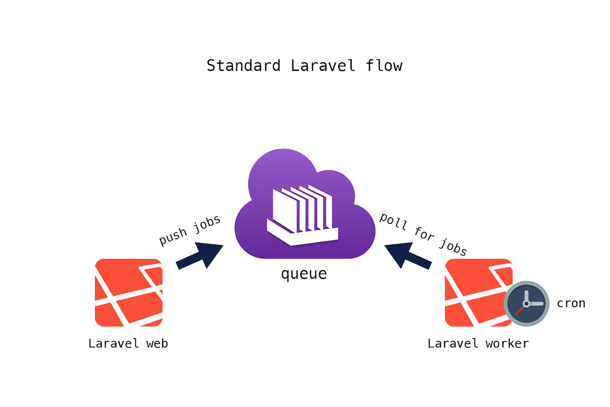
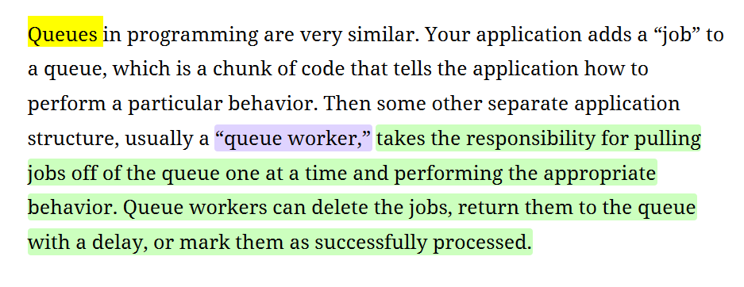

# Introduction Queues In Laravel 👩‍💻
## Problem : 

Currently, sending emails happens synchronously, meaning the user has to wait for the email to be delivered before receiving a response. Even a short wait like 2 seconds can negatively affect user experience.

## Solution :

Queues! We can move email delivery to the background using a queue Tool. This allows the user to receive a response immediately, while the email gets delivered asynchronously.

## Benefit :

Improved user experience. Users no longer have to wait for emails to be sent, making the application feel more responsive.

## ♦️ Queue Configuration

In the `config/queue.php` file, there are a variety of services and backends to assist with your queues.

Queue Connections: `"sync"`, `"database"`, `"beanstalkd"`, `"sqs"`, `"redis"`, `"null"`

- Use the `"sync"` driver to have the jobs run right in your application without actually being queued, or the `"null"` driver for jobs to just be discarded; these two are usually used in local development or testing environments.

- `"sync"`: Synchronous. That means run the job as part of the current request.

- `"database"`: It can handle queues for a long time.

- `"beanstalkd"`, `"sqs"`, `"redis"`: If you need something a little more robust.

```php
'default' => env('QUEUE_CONNECTION', 'database'),
```

file .env default in laravel 11  `QUEUE_CONNECTION=database`

The queue configuration allows switching between backends by simply changing an environment variable (ex: QUEUE_CONNECTION=redis).

The database driver requires a table to store jobs while they wait for processing. 
By default, Laravel provides a migration to create a table named "jobs" for this purpose.

```php
'table' => env('DB_QUEUE_TABLE', 'jobs'),
```

The configuration also includes settings for handling jobs that fail to process successfully. 
Similar to the main job table, the database driver uses a "failed_jobs" table to store information about these failed jobs.

 support for storing failed jobs in a simple file or in a database.

```php
'failed' => [
        'driver' => env('QUEUE_FAILED_DRIVER', 'database-uuids'),
        'database' => env('DB_CONNECTION', 'sqlite'),
        'table' => 'failed_jobs',
    ],`
```

# ♦️ Putting Queues into Action:

Switching to Queues: We modify the send method in the job controller to use queue instead. This tells the application to add the email delivery task to the queue instead of processing it immediately.

We check the email inbox (using MailTrap in this example) and see that the confirmation email hasn't arrived yet, confirming the asynchronous processing.
(store job email in queue)

# ♦️ Queue Workers


**Job Processing:** We learned that queues hold jobs waiting to be processed. But who does the processing?

**Queue workers**:  background processes responsible for taking jobs off the queue and executing them. 
 dedicated to handling jobs without interrupting the main application.



We run the` php artisan queue:work` command to start a queue worker.

The successful processing of the email delivery job confirms that the worker is functioning correctly.

Verification in MailTrap: We check the MailTrap inbox and see the confirmation email has arrived, demonstrating successful asynchronous email delivery.

using queues requires running one or more queue workers to process the jobs.

Queues make it easy to remove a costly or slow process from any
synchronous call.

A **dispatch** helper function with a queue closure or instance dedicated job classes .
 This will contain the code that the queue worker will execute.


```php
Route::get('test',function(){

    dispatch(function(){
        logger('hello from the queue');
    });

    return "Done";
});

```

When vist the http://example.test/test display Done  
the dispatch helper with a queue closure to add a job to the queue.

Checking the *storage/logs/laravel.log* confirms that the log message hasn't appeared yet. This is expected because the job hasn't been processed yet. (empty file)

A queue worker is necessary to execute the jobs that have been added to the queue.
 executed the ` php artisan queue:work` commend 

After running the queue worker, we revisit the laravel.log and see the log message ("Hello from the queue") has now appeared. This confirms that the dispatched job (logging the message) has been executed by the queue worker.

**Delayed Job Execution:**

```php
Route::get('test',function(){

    dispatch(function(){
        logger('hello from the queue');
    })->delay(5);

    return "Done";
});
```

This demonstrates how jobs can be scheduled to run at a specific time in the future.
For example, if you want to send a welcome email 15 minutes after the user signs up, that would be one way to handle that.


# ♦️ Dedicated Job Classes

We discussed using dispatch with closures for basic tasks. However, more complex jobs often require dedicated job classes.


## Scenario :
translating a job posting into multiple languages using AI might be a time-consuming process.


**Benefits of Job Classes:**

improved readability, and the encapsulation of complex job logic within a single class.

**Creating a Job Class :**

Using `php artisan make:job TranslateJob` command
Laravel automatically places this class in the *app/Jobs* directory.

**Dedicated Job Class Structure**

*constructor method* : Passing Data needed that job  to a Dedicated Job Class 

*handle method* :This is where the actual job logic resides


Term Job diff: 

1- in your App (job listing) App\Model\Job

2- in Queue Job (App\Job)


------
Since the job logic was modified(changes in handle method) the changes haven't been reflected in the running worker because it's still using the cached version of the job class from the initial load.

🟥📎***TIP***
Always restart the Job worker after making a code change. 

# ♦️ Dedicated Tools and Services : 

Manually running `php artisan queue:work` isn't feasible for production environments where the queue worker needs to be constantly running.

There are tools specifically designed to manage background processes like queue workers in production.

Supervisor is mentioned as a popular tool that helps ensure the queue worker stays running .


# ♦️ Resources :

- [Laracast : Queue in laravel](https://laracasts.com/series/30-days-to-learn-laravel-11/episodes/25)

- Book : Laravel Up & Running
  
 ### By: [Eman Hjazi](https://github.com/Eman-Hjazi)
